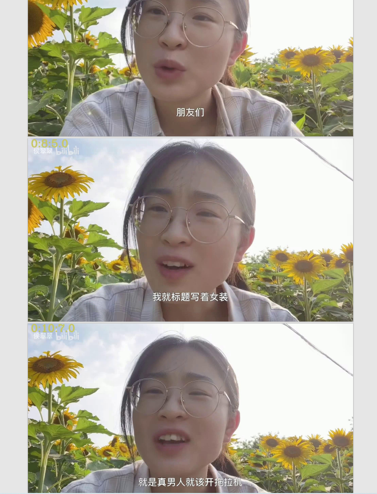

# Bilibili_video_convert_pdf

### 介绍
* 下载哔哩哔哩视频
* 视频转成关键帧PDF
* 默认下载支持格式中清晰度最高的

### 使用
* 本地文件转换成pdf
```python
    python main.py --address file_path[video]
```
* 哔哩哔哩视频转成pdf
```python
    # 单p下载 转换
    python main.py --address https://www.bilibili.com/video/BV19d4y197NK
    # 多个p 转换
    python main.py --address https://www.bilibili.com/video/BV1ZD4y1H72X
```
* 获取视频和音频支持格式 require_video_list

### 示例
* [原视频](https://www.bilibili.com/video/BV19d4y197NK?spm_id_from=333.851.header_right.history_list.click&vd_source=c60a8cff7283d8fe87cf05ce442b3759)

* [PDF](https://github.com/lrzjbyx/Bilibili_video_convert_pdf/resource/sample.pdf)

### 不足
* 合并视频速度慢且占据大量CPU
* 无交互式页面
* 无进度条显示
* 视频下载仅仅支持AV、BV

### 感谢开源
* [哔哩哔哩-API收集整理](https://github.com/SocialSisterYi/bilibili-API-collect)：B站API归档
* [哔哩下载姬](https://github.com/leiurayer/downkyi)：哔哩下载姬

### 声明
* 适合学习使用
* 不适用非法使用

